# Huong dan ve so do Chuong 3

Tai lieu nay gom:
- Vi tri chen tung hinh trong Word.
- Ten hinh de dung voi `Insert Caption`.
- Ma Mermaid de dan vao `https://mermaid.live/`.

## Cach dung

- Mo `https://mermaid.live/`
- Xoa doan ma mau co san
- Dan doan code Mermaid cua hinh can ve
- Chon `Actions` -> `Export` -> `PNG` hoac `SVG`
- Chen anh vao Word tai dung vi tri da ghi ben duoi
- Click vao anh trong Word
- Vao `References` -> `Insert Caption`
- Tao nhan `Hinh` neu Word chua co
- Chon `Position`: `Below selected item`
- Sua caption theo dung mau:
  + `Hinh 3.2.1: Kien truc tong the he thong`
  + `Hinh 3.7.6: So do Use Case chuc nang quan ly an toan`

## Hinh 3.2.1

- Ten hinh:
  + `Hinh 3.2.1: Kien truc tong the he thong`
- Loai hinh:
  + So do khoi kien truc he thong
- Vi tri chen:
  + Chen ngay sau muc `3.2.1 Kien truc tong the he thong`
  + Cu the la sau doan mo ta frontend, backend, Prisma, MySQL va cac thanh phan ho tro

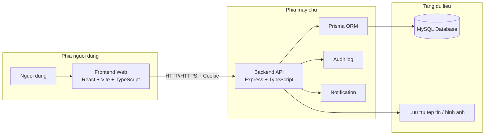

## Hinh 3.2.2

- Ten hinh:
  + `Hinh 3.2.2: So do Use Case tong quat cua he thong`
- Loai hinh:
  + So do Use Case tong quat
- Vi tri chen:
  + Chen ngay sau muc `3.2.4 So do Use Case tong quat`

```mermaid
flowchart TB
    Admin[Quan tri vien]
    PM[Truong du an]
    Engineer[Ky su cong truong]
    Safety[Can bo an toan]
    Quality[Can bo chat luong]
    Warehouse[Thu kho]
    Client[Chu dau tu / Giam sat]

    UC1((Dang nhap))
    UC2((Quan ly nguoi dung))
    UC3((Quan ly du an))
    UC4((Quan ly thanh vien))
    UC5((Quan ly cong viec))
    UC6((Bao cao ngay))
    UC7((Tai lieu va tep tin))
    UC8((Quan ly an toan))
    UC9((Quan ly chat luong))
    UC10((Quan ly kho vat tu))
    UC11((Quan ly ngan sach))
    UC12((Phe duyet))
    UC13((Dashboard va thong bao))
    UC14((Nhat ky he thong))

    Admin --> UC1
    Admin --> UC2
    Admin --> UC3
    Admin --> UC13
    Admin --> UC14

    PM --> UC1
    PM --> UC3
    PM --> UC4
    PM --> UC5
    PM --> UC6
    PM --> UC7
    PM --> UC10
    PM --> UC11
    PM --> UC12
    PM --> UC13

    Engineer --> UC1
    Engineer --> UC5
    Engineer --> UC6
    Engineer --> UC7
    Engineer --> UC13

    Safety --> UC1
    Safety --> UC8
    Safety --> UC12
    Safety --> UC13

    Quality --> UC1
    Quality --> UC9
    Quality --> UC12
    Quality --> UC13

    Warehouse --> UC1
    Warehouse --> UC10
    Warehouse --> UC13

    Client --> UC1
    Client --> UC3
    Client --> UC6
    Client --> UC9
    Client --> UC13
```

## Hinh 3.4.1

- Ten hinh:
  + `Hinh 3.4.1: Mo hinh phan quyen hai cap cua he thong`
- Loai hinh:
  + So do phan cap quyen
- Vi tri chen:
  + Chen ngay sau muc `3.4.1 Mo hinh phan quyen hai cap`

```mermaid
flowchart TD
    U[Nguoi dung] --> SR[Quyen cap cong ty<br/>System Role]
    U --> PR[Quyen cap du an<br/>Project Role]
    U --> TP[Quyen theo phan he<br/>Tool Permission]
    U --> SP[Quyen dac biet<br/>Special Privilege]

    SR --> A1[ADMIN]
    SR --> A2[STAFF]

    PR --> B1[PROJECT_MANAGER]
    PR --> B2[ENGINEER]
    PR --> B3[SAFETY_OFFICER]
    PR --> B4[DESIGN_ENGINEER]
    PR --> B5[QUALITY_MANAGER]
    PR --> B6[WAREHOUSE_KEEPER]
    PR --> B7[CLIENT]
    PR --> B8[VIEWER]

    TP --> C1[PROJECT]
    TP --> C2[TASK]
    TP --> C3[DAILY_REPORT]
    TP --> C4[FILE]
    TP --> C5[DOCUMENT]
    TP --> C6[SAFETY]
    TP --> C7[QUALITY]
    TP --> C8[WAREHOUSE]
    TP --> C9[BUDGET]

    SP --> D1[SAFETY_SIGNER]
    SP --> D2[QUALITY_SIGNER]
    SP --> D3[BUDGET_APPROVER]
```

## Hinh 3.4.2

- Ten hinh:
  + `Hinh 3.4.2: Luong xac thuc va quan ly phien dang nhap`
- Loai hinh:
  + So do trinh tu / sequence diagram
- Vi tri chen:
  + Chen ngay sau muc `3.4.2 Xac thuc va quan ly phien dang nhap`

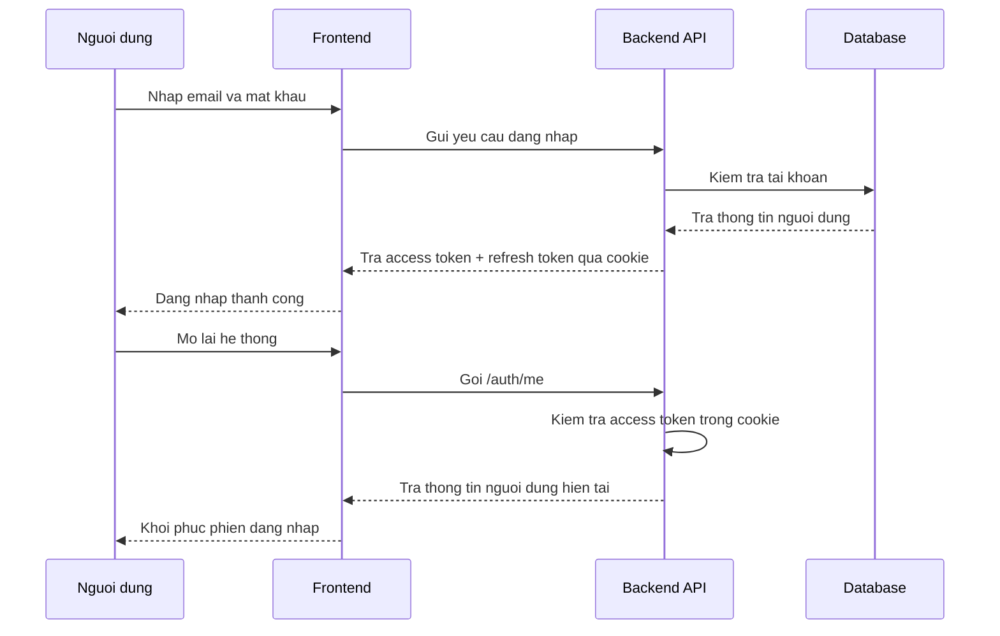

## Hinh 3.7.1

- Ten hinh:
  + `Hinh 3.7.1: So do Use Case chuc nang dang nhap he thong`
- Loai hinh:
  + So do Use Case
- Vi tri chen:
  + Chen ngay sau muc `3.7.1 Chuc nang dang nhap he thong`

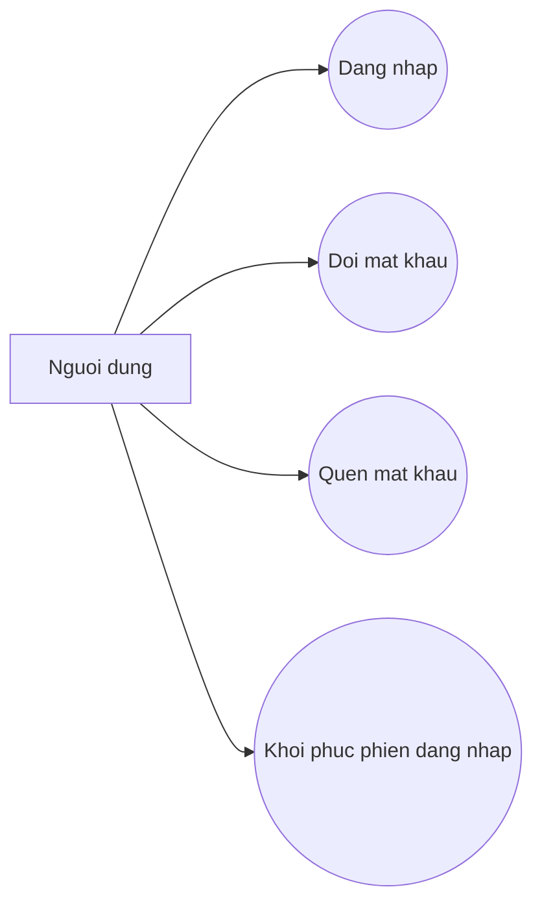

## Hinh 3.7.2

- Ten hinh:
  + `Hinh 3.7.2: So do Use Case chuc nang quan ly du an`
- Loai hinh:
  + So do Use Case
- Vi tri chen:
  + Chen ngay sau muc `3.7.2 Chuc nang quan ly du an`

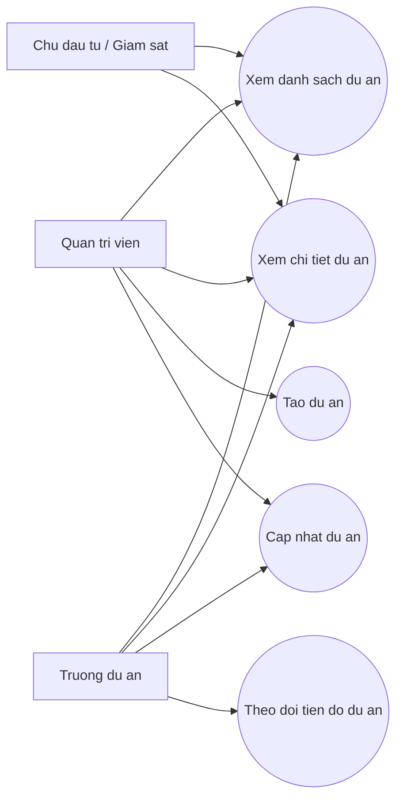

## Hinh 3.7.3

- Ten hinh:
  + `Hinh 3.7.3: So do Use Case chuc nang quan ly cong viec`
- Loai hinh:
  + So do Use Case
- Vi tri chen:
  + Chen ngay sau muc `3.7.3 Chuc nang quan ly cong viec`

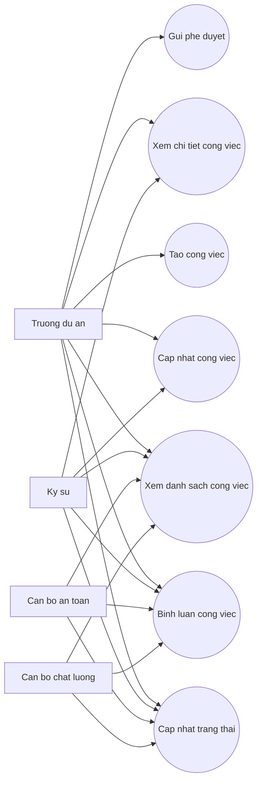

## Hinh 3.7.4

- Ten hinh:
  + `Hinh 3.7.4: So do Use Case chuc nang bao cao ngay`
- Loai hinh:
  + So do Use Case
- Vi tri chen:
  + Chen ngay sau muc `3.7.4 Chuc nang bao cao ngay`

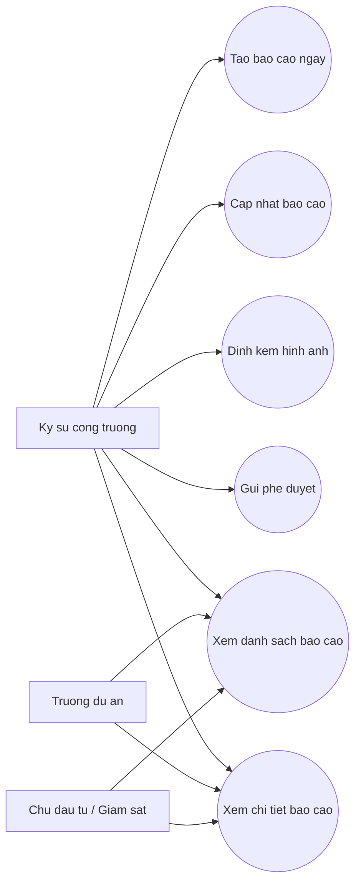

## Hinh 3.7.5

- Ten hinh:
  + `Hinh 3.7.5: So do Use Case chuc nang quan ly tai lieu va tep tin`
- Loai hinh:
  + So do Use Case
- Vi tri chen:
  + Chen ngay sau muc `3.7.5 Chuc nang quan ly tai lieu va tep tin`

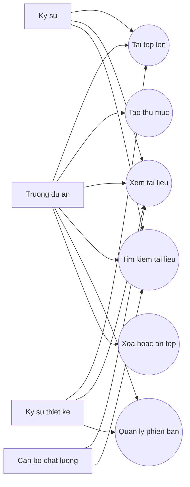

## Hinh 3.7.6

- Ten hinh:
  + `Hinh 3.7.6: So do Use Case chuc nang quan ly an toan`
- Loai hinh:
  + So do Use Case
- Vi tri chen:
  + Chen ngay sau muc `3.7.6 Chuc nang quan ly an toan`

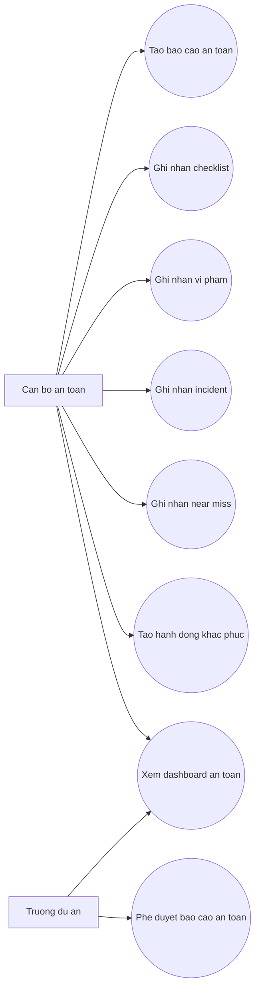

## Hinh 3.7.7

- Ten hinh:
  + `Hinh 3.7.7: So do Use Case chuc nang quan ly chat luong`
- Loai hinh:
  + So do Use Case
- Vi tri chen:
  + Chen ngay sau muc `3.7.7 Chuc nang quan ly chat luong`

## Hinh 3.7.8

- Ten hinh:
  + `Hinh 3.7.8: So do Use Case chuc nang quan ly kho vat tu`
- Loai hinh:
  + So do Use Case
- Vi tri chen:
  + Chen ngay sau muc `3.7.8 Chuc nang quan ly kho vat tu`

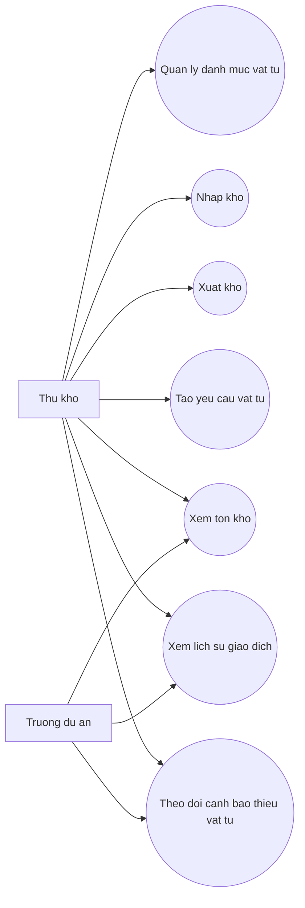

## Hinh 3.7.9

- Ten hinh:
  + `Hinh 3.7.9: So do Use Case chuc nang quan ly ngan sach va phe duyet`
- Loai hinh:
  + So do Use Case
- Vi tri chen:
  + Chen ngay sau muc `3.7.9 Chuc nang quan ly ngan sach va phe duyet`

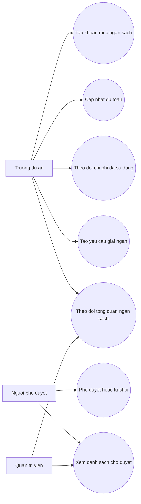

## Hinh 3.8.1

- Ten hinh:
  + `Hinh 3.8.1: Bieu do co so du lieu quan he`
- Loai hinh:
  + ERD / so do quan he du lieu
- Vi tri chen:
  + Chen ngay sau muc `3.8 Bieu do co so du lieu quan he`

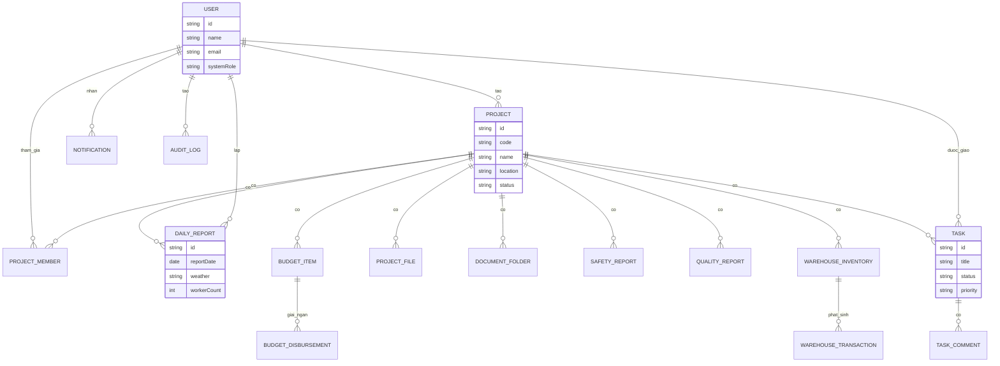

## Hinh 3.9.1

- Ten hinh:
  + `Hinh 3.9.1: Bieu do trien khai he thong`
- Loai hinh:
  + Deployment diagram / so do trien khai
- Vi tri chen:
  + Chen ngay sau muc `3.9 Bieu do trien khai he thong`

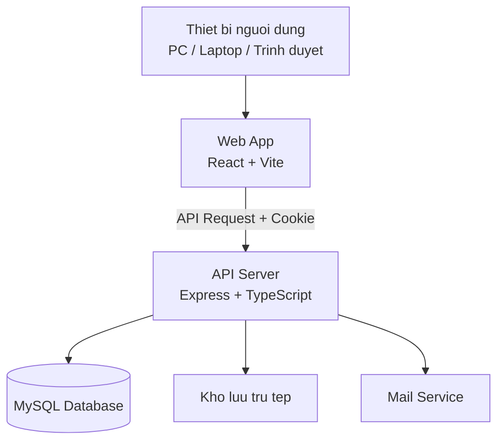

## Tong hop vi tri chen trong Word

- Sau muc `3.2.1` chen `Hinh 3.2.1`
- Sau muc `3.2.4` chen `Hinh 3.2.2`
- Sau muc `3.4.1` chen `Hinh 3.4.1`
- Sau muc `3.4.2` chen `Hinh 3.4.2`
- Sau muc `3.7.1` chen `Hinh 3.7.1`
- Sau muc `3.7.2` chen `Hinh 3.7.2`
- Sau muc `3.7.3` chen `Hinh 3.7.3`
- Sau muc `3.7.4` chen `Hinh 3.7.4`
- Sau muc `3.7.5` chen `Hinh 3.7.5`
- Sau muc `3.7.6` chen `Hinh 3.7.6`
- Sau muc `3.7.7` chen `Hinh 3.7.7`
- Sau muc `3.7.8` chen `Hinh 3.7.8`
- Sau muc `3.7.9` chen `Hinh 3.7.9`
- Sau muc `3.8` chen `Hinh 3.8.1`
- Sau muc `3.9` chen `Hinh 3.9.1`
